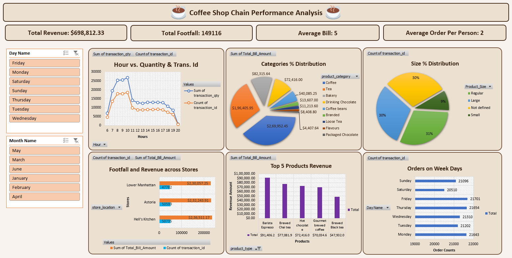

# Coffee Shop Chain Performance Analysis

This project analyzes the performance metrics of a coffee shop (by using advanced excel) chain to help understand trends, optimize business strategies, and make data-driven decisions. 📊☕

The project includes a clean, insightful dashboard based on key performance indicators (KPIs) derived from business data.

## 📂 Project Structure
```
coffee-shop-chain-performance-analysis/
|-- Coffee_Shop_Chain_Performance_Analysis.xlsx     # Dataset used for analysis (149,000+ data points)
|-- Dashboard_Screenshot.png                        # Screenshot of the final dashboard
|-- README.md                                       # Project documentation
```

## 📈 Key Features

- Comprehensive sales and performance analysis.
- Visual dashboard summarizing key metrics.
- Insights on product categories, sales trends, and business growth.
- Easy-to-understand Excel-based implementation (no programming knowledge required!).

## 🚀 How to Use

1. Clone the repository:
   ```bash
   git clone https://github.com/oshin-pal/coffee-shop-chain-performance-analysis.git
   ```
2. Open the Excel file:
   - `Coffee_Shop_Chain_Performance_Analysis.xlsx`
3. Explore the dashboard and sheets:
   - Analyze sales trends, top-performing products, and overall performance insights.

## 🖼️ Dashboard Preview



> *The dashboard provides a clear, visual summary of the coffee shop's key business metrics.*

## 🤝 Contributing

Contributions are welcome!  
If you have suggestions for improvements, feel free to open an issue or submit a pull request.

## 🙋‍♀️ About Me

Hii, I am Oshin! Created with 💙 to demonstrate business intelligence and dashboarding skills.
